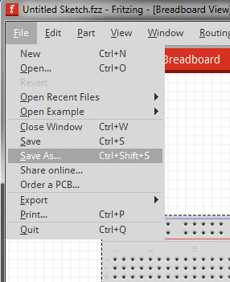
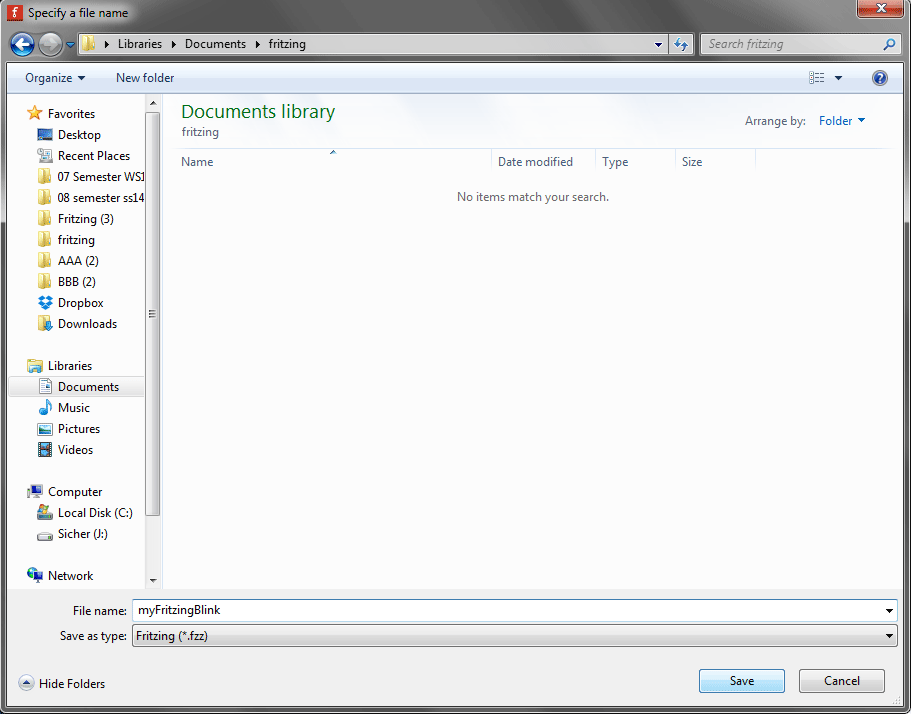
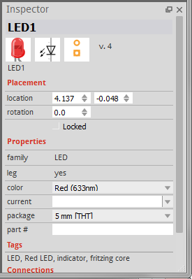
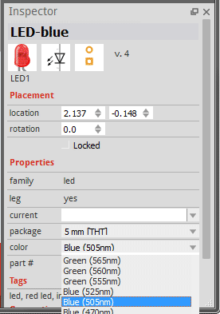
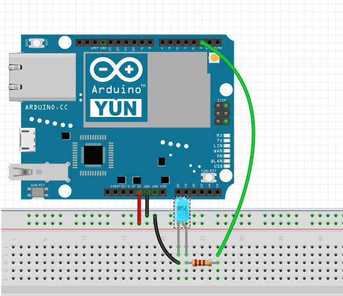
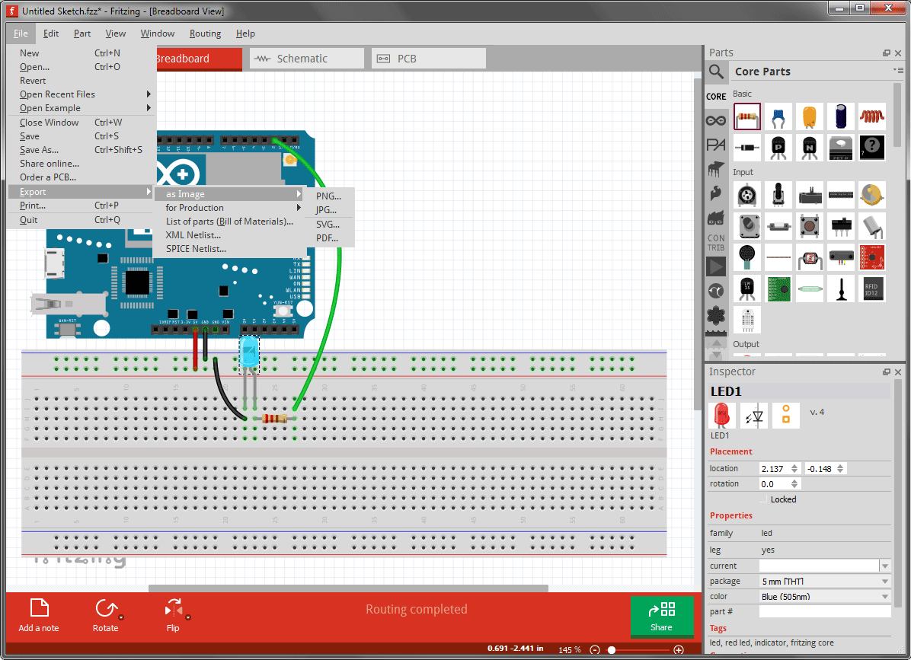

## Breadboardview ##

The Breadboard-Tab is the first View. In here you can easily copy your real work as a digital dokumentation. Or have a look on other projects or examples how you can use specific hardware and modify it to your needs. 

Let's begin with a simple Led-Blink for example.

### 1. Building a Circuit ###

1. Starting a new project:

	Before starting a project in Fritzing, you will need to build an electronic circuit in the real world and make sure it works properly. You will then virtually rebuilt the circuit in Fritzing.
	Let's start by opening Fritzing, naming and saving our project. Saving a project is highly recommended at start and every now and then while working, since Fritzing is still Alpha and unfortunately might sometimes crash...

	1. From the Fritzing menu bar select File > Save As... 
	
	 
	2. Specify a name and location for the project and click Save 
	
	 
2. transfer your Circuit

	Make sure your circuit in the real world works properly. Then rebuild your circuit in Fritzing following these guidelines:
	1. Drag & drop an Arduino or another Microcontroller of your choise from the Parts palette window to the Project View. 
	
     
	2. Do the same with a breadboard and all other parts of your circuit. If you cannot find a part in the library, use the Mystery Part (icon looks like a qustion mark - ?). The Mystery Part will let you quickly define a new part and its connectors (through the Inspector). Or use the generic ic. it has e.g. multiple smd footprints. 
	3. You can arrange parts by selecting, dragging and dropping, or by using the functions in the menu bar, located under Part.
	4. To delete a part, simply select and press BACKSPACE or Del.
	5. Click & drag the Arduino +5V connector. This should create a wire. Drop the wire on one of the breadboard's connectors. The connection is confirmed by a small green circle or square.
	6. Connect all parts until the circuit looks exactly like your circuit in the real world. Notice that connectors that are not properly connected are painted red.
	7. If you click and hold on a connector, Fritzing will highlight all equipotential connectors. This can really be useful if you want to see the whole set of connections attached to this particular connection.
	8. You can bend wires by adding bend-points. Just drag them out of a wire. Hit strg on a wire to make it curved.	 
	
	 
3. Editing properties

	Now that we have all parts connected, let's see how we can modify the properties of each part.
	1. Select any of your circuit's parts and have a look at the Part Inspector palette window. 
	
     
	2. Click on the part's name and rename it. This is useful when you want to distinguish between similar parts. 
	
     
	3. Try also to change other properties.
	 
	 
	
	You can also change properties of parts in the PCB View. The board's shape could be changed to an Arduino shield, a resizable rectangle or a custom shape. 	
    
     

4. Exporting a circuit

	After finishing building the circuit, save your project. You might want to export your circuit as an image file or PDF.
	1. Select the desired Project View to be exported (breadboard,schematic or pcb).
	2. From the Fritzing menu bar, select File > Export > and the desired format. 
	
	 
    
### 2. external learning material ###

1. Using a Stripboard (from the video channel)
2. Working with SMD parts (from the video channel)
3. Creating Paper Templates (from the Blog)
4. Curvy Wires and bendable Legs (from the Blog)
